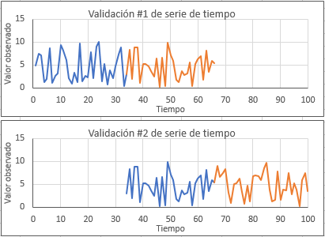

## Validacion cruzada k-fold en Series de Tiempo
Los criterios para calibración y validación que usan los algoritmos de ML son usualmente la partición de la base de datos en dos: entrenamiento (train) y evaluación (test). Sin embargo, los métodos clásicos de partición no se aplican a series de tiempo debido que estos criterios ignoran la secuencia temporal que es una característica fundamental de las series de tiempo. En este tipo de datos los modelos de ML emplean técnicas de separación llamados **backtesting** or **hindcasting**.

### Por que los métodos clásicos de evaluación (separación) de un modelo ML no son aplicables en Series de Tiempo?
Los métodos clásicos de evaluación de un modelo de ML asume que las observaciones son independientes del tiempo. Esta consideracion no es cierta en series de tiempo.
En series de tiempo no se pueden separar aleatoriamente la data en data observaciones de entrenamiento y evaluacion, sino debemos considerar la separación de observaciones manteniendo la secuencia de las observaciones en el tiempo.

En el pronóstico de series de tiempo, esta evaluación de modelos sobre datos históricos se denomina **backtesting**. En algunos dominios de series de tiempo, como la meteorología, esto se denomina predicción retrospectiva, en lugar de predicción.

A continuación se describen tres métodos de backtest de evaluación de series de tiempo en ML: Separación Train-Test, múltiple separación Train-Test, y validación progresiva.
#### Separación Train-Test (Train-Test split)
Esta saparación de serie de tiempo consiste en establecer un punto de partición de la serie para obtener dos series, la primera serie de entrenamiento (train) antes del punto de partición y la segunda serie de evaluación (test) después del punto. Según la cantidad de observaciones (logitud de la serie), la separación puede ser de 50%-50%, 60%-40%, 70%-30% y otro.
#### Múltiple separación Train-Test (Múltiple Train-Test splits)
Consiste en repetir el proceso anterior de separación de la serie varias veces. La múltiple separación de la serie en train-test, permite tener varios pares train-test lo que resulta en modelo ML más robusto.

Esta múltiple separación puede hacerse manualmente, repitiendo la separación de la serie en varios puntos; sin embargo, la librería scikit-learn provee una función para esto.
En esta separación, se debe especificar el numero de particiones a crear. Por ejmplo, en una serie de 100 observaciones, si se establece 2 particiones, la serie se dividirá en tres sub series. 
- El primer entrenamiento será empleando las primeras 33 observaciones y la evaluación (test) usando las siguientes 33 observaciones.
- El segundo entrenamiento será empleando las primeras 67 observaciones y la evaluación usando las siguientes 33 obs.
- Entonces, en esta serie dos particiones implica dos entrenamientos.

Primer entrenamiento: Train 33 obs, Test 33 obs. Segundo entrenamiento: Train 67 obs, test 33 obs.

En esta modalidad, generalmente la longitud de la evaluación (test size) se mantiene constante para tenener un buena consistencia al momento de comparar y/o promediar la evaluación del modelo. Lo que cambia es la longitud de las obs de entrenamiento.

Alternativamente, la longitud de observaciones también pordrian mantenerse constante, es decir usar solo las ultimas 33 observaciones para prdecir las siguientes 33 observaciones, en el ejemplo anterior.

#### Validación progresiva (Walk-forward)
Se debe establecer dos parametros:
- El mínimo número de observaciones para el entrenamiento (nmin). En algunos casos esto puede ser difícil, sobre todo en registros cortos.
- El tipo de ventana (desplazamiento o expansión). Determina si el modelo será entrenado en los datos disponibles (ventana en expansión) o solo en las obsevaciones más recientes (ventana fija de desplazamiento).

Estos parametros se procesan como sigue:
- Empezando del inicio de la serie, se toma mínimo número de observaciones (ventana o serie de entrenamiento) para entrenar el primer modelo de ML. Por ejemplo, en una serie de 75 observaciones, se establece el mínimo número de observaciones en 50, la serie de entrenamiento es: v1, v2,...,v50.
- El modelo hace la predicción del siguiente valor de la serie (es decir del valor v51)
- La prediccion es comparada con el valor conocido.
- Se continúa con la siguiente predicción. 
- En el caso de ventana fija, ésta se desplaza en una unidad y la nueva serie de entrenamiento es: v2, v3,...,v51, para predecir el siguiente valor de la serie V52. 
- Este valor (V52) se compara con el valor conocido. El proceso se repite hasta predecir el último valor de la serie V75.
- En el caso de ventana en expansión, en la segunda predicción, la ventana se amplia en una unidad. Entonces la nueva serie de entrenamiento es: v1,v2,v3,...,v51, para predecir el valor de la serie V52.
- El valor (V52) se compara con el valor conocido. El proceso se repite, ampliando la ventana, hasta predecir el último valor de la serie V75.

De este modo, este método considera la ampliacion de la serie de entrenamiento en una unidad de tiempo en cada repetición. Este método toma el nombre de "Walk-forward", "walk-forward validation" o "Rolling-window Analysis" o "Rolling forecast".

Este método genera más modelos de entrenamiento con la desventaja de incrementar el costo computacional. Este método contribuye a un modelo ML mucho més robusto. Se debe prestar atención al ancho de la ventana y al tipo de ventana, estos podrían ajustarse para idear un ancho de prueba de tal forma sea significativamente menos costoso desde el punto de vista computacional.

La validación progresiva de las Series de Tiempo (ST) es el equivalente a la validación cruzada en los modelos estándares de ML. Su uso en ST es muy recomendado.

See here:
https://machinelearningmastery.com/backtest-machine-learning-models-time-series-forecasting/

